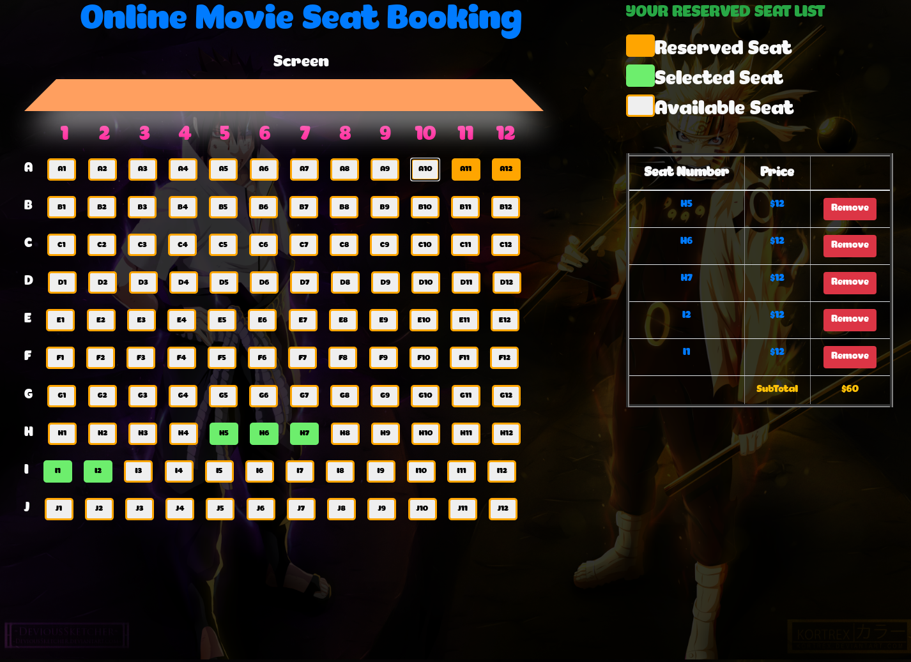

# Getting Started with Create React App

This project was bootstrapped with [Create React App](https://github.com/facebook/create-react-app).

## Project Description

This project to reserve seat booking online. The selected seat will have green as color. If the user click that seat again, it will automatically turn back to white as available seat. The selected seat list will be on the right side with remove button next to each seat.

## Available Scripts

In the project directory, you can run:

### `yarn start`

Runs the app in the development mode.\
Open [http://localhost:3000](http://localhost:3000) to view it in the browser.

## Project View

